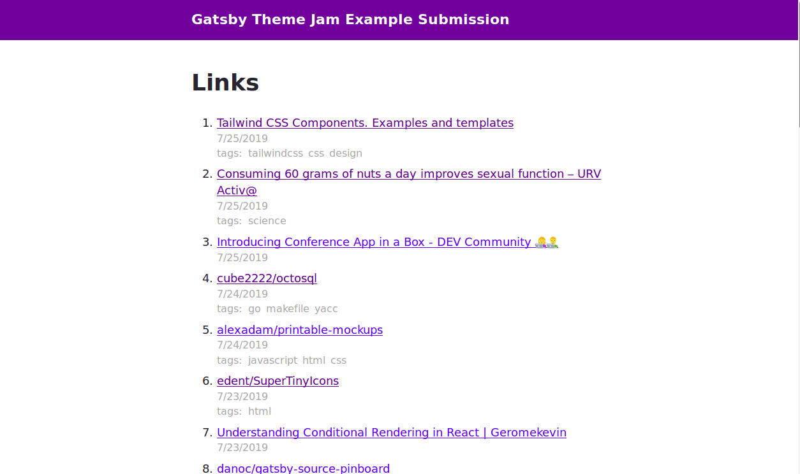

# Gatsby Theme Link Site

- [Demo README](demo/README.md)
- [Theme Package README](theme/README.md)

## Introduction

This theme adds a '/links' page to your site that shows your 100 most recent bookmarks or stars on Github.

You need a Pinboard auth-token or a Github personal token to make this work.

## Motivation

Before the times of Reddit and Hacker News it was quite common for homepages to have link sections.

I miss those times, but I realisticially am not going to update one. But I do bookmark things and I do star things on Github.

## Screenshot

This is my submission to the [Gatsby Theme Jam](https://themejam.gatsbyjs.org/).
